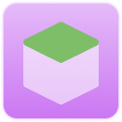

<!-- PROJECT LOGO -->
 

  

<h3 align="center">Polymerium</h3>

  

    为 Minecraft 准备的游戏实例管理器
     
    <a href="https://github.com/d3ara1n/Polymerium/wiki"><strong>查看文档 »</strong></a>
     
     
    <a href="https://github.com/d3ara1n/Polymerium/issues">反馈</a>
    ·
    <a href="https://github.com/d3ara1n/Polymerium/discussions">讨论</a>
  

<!-- PROJECT SHIELDS -->
[![Contributors][contributors-shield]][contributors-url]
[![Forks][forks-shield]][forks-url]
[![Stargazers][stars-shield]][stars-url]
[![Issues][issues-shield]][issues-url]
[![MIT License][license-shield]][license-url]

<!-- ABOUT THE PROJECT -->
## 关于

[![Screenshot][product-screenshot]](#关于)

**这是个 WIP 项目，大部分功能还没写完或仅存在于设计，开发进度请参考 Roadmap。**

### 理念

正如其缝合的名字一样，Polymerium 的主要目标是整合 Minecraft 的游戏资源，而非单单启动游戏。其使用与启动器完全不同的思路来管理游戏资源：创建实例元数据，使用还原引擎将游戏本地文件还原到元数据所描述的状态；Polymerium 不维护游戏文件，只维护实例元数据。有关于 Polymerium 的模式请参阅还没开始写的文档。

### 吐槽

WinUI 3 目前还在早期阶段，一路下来难用，性能差不说，遇到的bug还不少，总之不建议入坑。

### 使用以下技术栈和工具构建

* [![C#][CSharp]][CSharp-url]
* [![dotnet][DotNet]][DotNet-url]
* [![WinUI3][WinUI]][WinUI-url]
* [![WindowsAppSDK][WindowsAppSDK]][WindowsAppSDK-url]
* [![Rider][Rider]][Rider-url]
* [![VisualStudio][VisualStudio]][VisualStudio-url]
* [![VisualStudioCode][VSCode]][VSCode-url]

<!-- GETTING STARTED -->
## 入门

目前不入门。

### 安装

目前不分发。

<!-- ROADMAP -->
## Roadmap

* [x] 创建文件夹
* [ ] 实例管理
  * [x] 从空模板创建
  * [x] 删除
  * [ ] 解锁（转换为 untagged 实例）
  * [ ] 导入/导出
    * [ ] Polypack
    * [ ] CurseForge
* [ ] 启动游戏
  * [x] Polylock 文件
  * [ ] 可选参数
    * [ ] 自定义 JVM 参数
    * [ ] 预定义的优化 JVM 参数
  * [ ] 先决条件检查
    * [ ] Java 版本自动选择和兼容性检查
  * [ ] 行星搅拌机
    * [x] Fire-and-forget 模式
    * [ ] Managed 模式
      * [ ] 订阅日志
        * [ ] 保存到文件
      * [ ] 进程管理
  * [x] 参数解析
* [ ] 账号管理
  * [ ] 管理模型
    * [x] 添加
    * [ ] 移除
      * [ ] 等 FlyoutSubMenu 的 bug 被修复
* [ ] 还原引擎
  * [x] 基于 Stage 模型
  * [ ] 组件安装
    * [x] 香草
    * [ ] Forge
    * [ ] Fabric
    * [ ] Quilt
  * [ ] 附件
* [ ] 资源附件
  * [ ] 资源解析引擎
  * [ ] 内置解析器
    * [ ] 整合包
      * [ ] Modrinth
      * [ ] CurseForge
    * [ ] 模组
      * [ ] 本地仓库
      * [ ] Modrinth
      * [ ] CurseForge
    * [ ] 资源包
      * [ ] 本地仓库
      * [ ] Modrinth
      * [ ] CurseForge
    * [ ] 文件附件
      * [ ] 本地仓库
* [ ] 搜索
  * [ ] 搜索中心
  * [ ] SearchBar
  * [ ] 托管的实例搜索
  * [ ] 互联网资源搜索
* [ ] 软件设置
* [ ] 游戏实例设置
  * [ ] 元数据编辑
  * [ ] 私有配置页面
* [ ] 本地化

更多细节请在 [Issues](https://github.com/d3ara1n/Polymerium/issues)中查询。

<!-- LICENSE -->
## License

Distributed under the MIT License. See `LICENSE.txt` for more information.

## Stats

<!-- MARKDOWN LINKS & IMAGES -->
<!-- https://www.markdownguide.org/basic-syntax/#reference-style-links -->
[contributors-shield]: https://img.shields.io/github/contributors/d3ara1n/Polymerium.svg?style=for-the-badge
[contributors-url]: https://github.com/d3ara1n/Polymerium/graphs/contributors
[forks-shield]: https://img.shields.io/github/forks/d3ara1n/Polymerium.svg?style=for-the-badge
[forks-url]: https://github.com/d3ara1n/Polymerium/network/members
[stars-shield]: https://img.shields.io/github/stars/d3ara1n/Polymerium.svg?style=for-the-badge
[stars-url]: https://github.com/d3ara1n/Polymerium/stargazers
[issues-shield]: https://img.shields.io/github/issues/d3ara1n/Polymerium.svg?style=for-the-badge
[issues-url]: https://github.com/d3ara1n/Polymerium/issues
[license-shield]: https://img.shields.io/github/license/d3ara1n/Polymerium.svg?style=for-the-badge
[license-url]: https://github.com/d3ara1n/Polymerium/blob/master/LICENSE.txt
[product-screenshot]: assets/images/Screenshot.gif
[CSharp]: https://img.shields.io/badge/C%23-11-239120?style=for-the-badge&logoColor=white
[CSharp-url]: https://learn.microsoft.com/en-us/dotnet/csharp/
[DotNet]: https://img.shields.io/badge/.NET-7-5C2D91?style=for-the-badge&logoColor=white
[DotNet-url]: https://dotnet.microsoft.com/
[WinUI]: https://img.shields.io/badge/WinUI-3-0F5197?style=for-the-badge&logoColor=white
[WinUI-url]: https://microsoft.github.io/microsoft-ui-xaml/
[WindowsAppSDK]: https://img.shields.io/badge/Windows%20App%20SDK-1.2-348753?style=for-the-badge&logoColor=white
[WindowsAppSDK-url]: https://github.com/microsoft/WindowsAppSDK
[Rider]: https://img.shields.io/badge/Rider-DE1369?style=for-the-badge&logo=Rider&logoColor=white
[Rider-url]: https://www.jetbrains.com/rider/
[VisualStudio]: https://img.shields.io/badge/Visual_Studio-5C2D91?style=for-the-badge&logo=visual%20studio&logoColor=white
[VisualStudio-url]: https://visualstudio.microsoft.com
[VSCode]: https://img.shields.io/badge/Visual_Studio_Code-0078D4?style=for-the-badge&logo=visual%20studio%20code&logoColor=white
[VSCode-url]: https://code.visualstudio.com/
