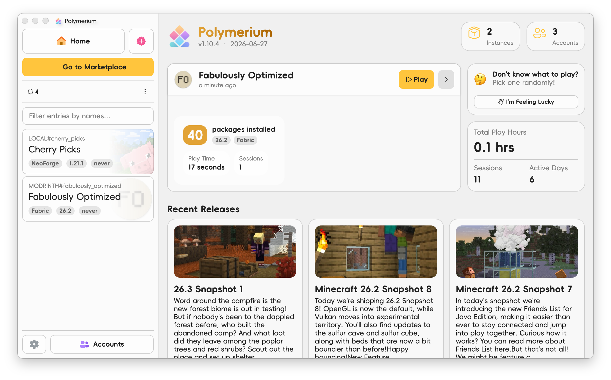
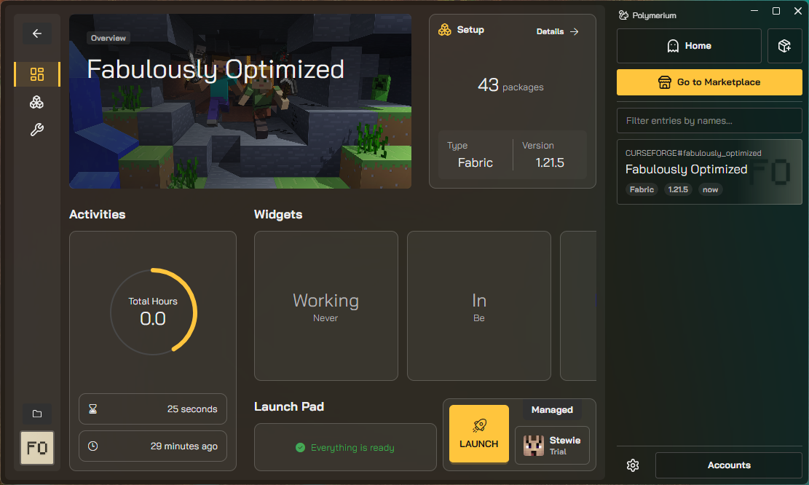
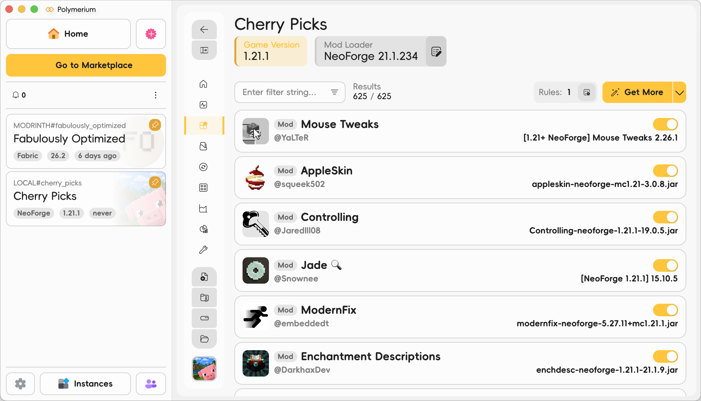
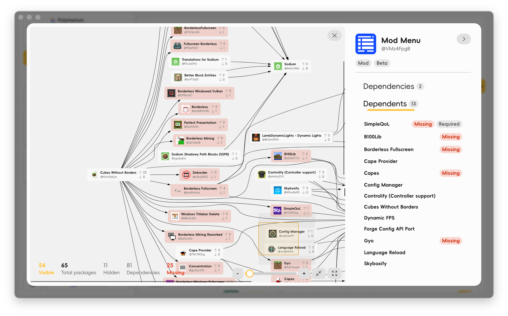
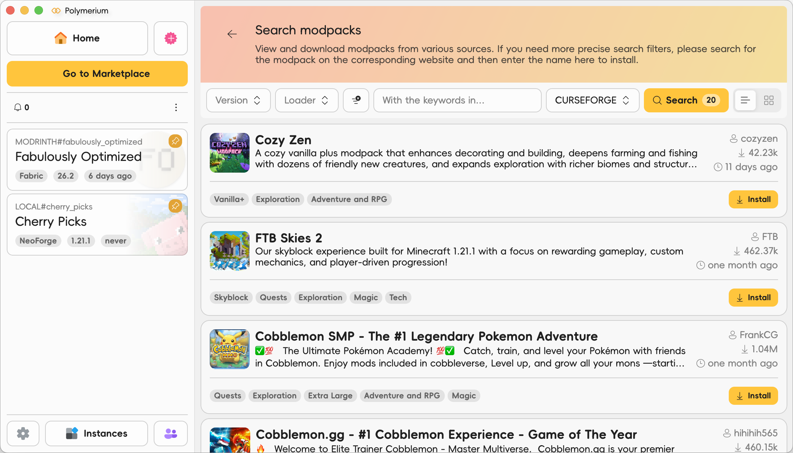

# Polymerium


<div align="center">

**A Minecraft instance manager built on a simple idea: your instance is a recipe, not a pile of copied files.**

[](https://opensource.org/licenses/MIT)
[](https://dotnet.microsoft.com/)
[](https://avaloniaui.net/)
[](https://learn.microsoft.com/en-us/dotnet/csharp/)
[![zread](https://img.shields.io/badge/Ask_Zread-_.svg?style=for-the-badge&color=00b0aa&labelColor=000000&logo=data%3Aimage%2Fsvg%2Bxml%3Bbase64%2CPHN2ZyB3aWR0aD0iMTYiIGhlaWdodD0iMTYiIHZpZXdCb3g9IjAgMCAxNiAxNiIgZmlsbD0ibm9uZSIgeG1sbnM9Imh0dHA6Ly93d3cudzMub3JnLzIwMDAvc3ZnIj4KPHBhdGggZD0iTTQuOTYxNTYgMS42MDAxSDIuMjQxNTZDMS44ODgxIDEuNjAwMSAxLjYwMTU2IDEuODg2NjQgMS42MDE1NiAyLjI0MDFWNC45NjAxQzEuNjAxNTYgNS4zMTM1NiAxLjg4ODEgNS42MDAxIDIuMjQxNTYgNS42MDAxSDQuOTYxNTZDNS4zMTUwMiA1LjYwMDEgNS42MDE1NiA1LjMxMzU2IDUuNjAxNTYgNC45NjAxVjIuMjQwMUM1LjYwMTU2IDEuODg2NjQgNS4zMTUwMiAxLjYwMDEgNC45NjE1NiAxLjYwMDFaIiBmaWxsPSIjZmZmIi8%2BCjxwYXRoIGQ9Ik00Ljk2MTU2IDEwLjM5OTlIMi4yNDE1NkMxLjg4ODEgMTAuMzk5OSAxLjYwMTU2IDEwLjY4NjQgMS42MDE1NiAxMS4wMzk5VjEzLjc1OTlDMS42MDE1NiAxNC4xMTM0IDEuODg4MSAxNC4zOTk5IDIuMjQxNTYgMTQuMzk5OUg0Ljk2MTU2QzUuMzE1MDIgMTQuMzk5OSA1LjYwMTU2IDE0LjExMzQgNS42MDE1NiAxMy43NTk5VjExLjAzOTlDNS42MDE1NiAxMC42ODY0IDUuMzE1MDIgMTAuMzk5OSA0Ljk2MTU2IDEwLjM5OTlaIiBmaWxsPSIjZmZmIi8%2BCjxwYXRoIGQ9Ik0xMy43NTg0IDEuNjAwMUgxMS4wMzg0QzEwLjY4NSAxLjYwMDEgMTAuMzk4NCAxLjg4NjY0IDEwLjM5ODQgMi4yNDAxVjQuOTYwMUMxMC4zOTg0IDUuMzEzNTYgMTAuNjg1IDUuNjAwMSAxMS4wMzg0IDUuNjAwMUgxMy43NTg0QzE0LjExMTkgNS42MDAxIDE0LjM5ODQgNS4zMTM1NiAxNC4zOTg0IDQuOTYwMVYyLjI0MDFDMTQuMzk4NCAxLjg4NjY0IDE0LjExMTkgMS42MDAxIDEzLjc1ODQgMS42MDAxWiIgZmlsbD0iI2ZmZiIvPgo8cGF0aCBkPSJNNCAxMkwxMiA0TDQgMTJaIiBmaWxsPSIjZmZmIi8%2BCjxwYXRoIGQ9Ik00IDEyTDEyIDQiIHN0cm9rZT0iI2ZmZiIgc3Ryb2tlLXdpZHRoPSIxLjUiIHN0cm9rZS1saW5lY2FwPSJyb3VuZCIvPgo8L3N2Zz4K&logoColor=ffffff)](https://zread.ai/d3ara1n/Polymerium)

[](https://app.codacy.com/gh/d3ara1n/Polymerium/dashboard?utm_source=gh&utm_medium=referral&utm_content=&utm_campaign=Badge_grade)
[](https://www.codefactor.io/repository/github/d3ara1n/polymerium)

[🌐 中文介绍](https://github.com/d3ara1n/Polymerium/blob/main/README.zh.md) • [📥 Download](https://github.com/d3ara1n/Polymerium/releases) • [📖 Documentation](https://polymerium.dearain.dev) • [🐛 Report Bug](https://github.com/d3ara1n/Polymerium/issues) • [💡 Request Feature](https://github.com/d3ara1n/Polymerium/issues)

</div>

---

## In action

<div align="center">

[](#in-action)

*From opening the app to launching the game.*

</div>

---

## What makes it different

> An instance in Polymerium is a description, not a pile of copied files.

Change the loader, swap mods in and out, update the whole pack — the description changes, Polymerium rebuilds the files
on demand, and your saves and settings stay put.

- **Switch loaders without rebuilding.** Forge to NeoForge, Fabric to Quilt — change the loader, redeploy, keep your
  mods.
- **Update modpacks in place.** Drop in a new version; your saves, settings and worlds carry over.
- **Roll back anything.** Every change can be snapshotted. Break something? One click restores it, with a diff of
  exactly what moved.

Because files are linked instead of duplicated, ten modpacks sharing the same mods don't cost ten times the disk. Your
whole setup fits in a tiny config file — version-control it, share it, move it between machines.

---

## Features

<div align="center">
<table>
  <tr>
    <td width="55%" valign="top">
      <b>Everything at a glance</b><br><br>
      All your instances, accounts, and the worlds you've been playing — in one place. Jump back into what you were doing, or start something new.
    </td>
    <td width="45%">
      
    </td>
  </tr>
  <tr>
    <td width="45%">
      
    </td>
    <td width="55%" valign="top">
      <b>Deploy and launch</b><br><br>
      Pick an instance, hit play. Polymerium turns the metadata into a running game in one step — no manual file juggling, and jumping to another instance is instant.
    </td>
  </tr>
  <tr>
    <td width="55%" valign="top">
      <b>Manage mods, not files</b><br><br>
      Browse, filter, enable and update mods as entries in a list — not as files in a folder. Switch between list and grid, filter by source or type, update one mod or the whole pack.
    </td>
    <td width="45%">
      
    </td>
  </tr>
  <tr>
    <td width="45%">
      
    </td>
    <td width="55%" valign="top">
      <b>See the full dependency graph</b><br><br>
      Every mod and every layer of dependency, laid out visually. Spot conflicts and missing requirements before you ever hit launch.
    </td>
  </tr>
  <tr>
    <td width="55%" valign="top">
      <b>Install from the big marketplaces</b><br><br>
      CurseForge and Modrinth, built in. Search, filter by game version and loader, and install straight into an instance without leaving the app.
    </td>
    <td width="45%">
      
    </td>
  </tr>
</table>
</div>

### And more

- **Snapshots** — save and restore complete game states, with a diff view of what changed.
- **Git-friendly modpacks** — an instance is a config file, so you can version-control your pack and collaborate on it.
- **Cross-platform** — Windows, Linux and macOS (Apple Silicon) from one codebase.
- **Clean uninstall** — remove Polymerium entirely by deleting two folders.

---

## Getting Started

### Installation

> [!NOTE]
> Polymerium is in active development. Features and UI may change between releases.

**Microsoft OAuth · Open source MIT · Credentials never leave your machine.**

Before downloading, check the note for your platform:

<details>
<summary>🪟 <strong>Windows</strong> — enable Developer Mode (required for symlinks)</summary>

Polymerium uses [symbolic links](https://www.wikiwand.com/en/Symbolic_link) for efficient file management. Enable
Developer Mode to allow symlink creation without administrator privileges.

**Windows 11**

```
Settings → System → For developers → Developer Mode
```

**Windows 10**

```
Settings → Update & Security → For developers → Developer Mode
```

**Windows 7/8**

```
Upgrade to Windows 10+ first 💥
```

</details>

<details>
<summary>🍎 <strong>macOS</strong> — "Installer is damaged" workaround</summary>

The PKG installer is not signed with an Apple Developer certificate, so macOS Gatekeeper may block it with a "damaged"
message.

1. Right-click the `.pkg` file and choose **Open**.
2. If that doesn't work, remove the quarantine flag from Terminal:

   ```bash
   xattr -d com.apple.quarantine Polymerium-osx-arm64-Setup.pkg
   ```

3. Open the `.pkg` file again and follow the installer.

</details>

| Platform            | Package       | Direct Download                                                                                     |
|---------------------|---------------|-----------------------------------------------------------------------------------------------------|
| Windows x64         | Installer     | [Download](https://github.com/d3ara1n/Polymerium/releases/latest/download/Polymerium-win-Setup.exe) |
| Linux x64           | AppImage      | [Download](https://github.com/d3ara1n/Polymerium/releases/latest/download/Polymerium.AvaloniaImage) |
| macOS Apple Silicon | PKG installer | [Download](https://github.com/d3ara1n/Polymerium/releases/latest/download/Polymerium-osx-Setup.pkg) |

[已有 Mirror酱 CDK？前往 Mirror酱 高速下载](https://mirrorchyan.com/zh/projects?rid=Polymerium&channel=Polymerium_setup&source=github-readme)

1. **Download** the package for your platform
2. **Run** the installer or executable
3. **Follow** the setup wizard to configure your first instance

### Quick start

1. **Create** an instance — pick a Minecraft version and a mod loader
2. **Add content** — install mods from CurseForge or Modrinth
3. **Deploy** — Polymerium builds the game files
4. **Play** — launch it, or export the whole thing as a modpack

---

## Architecture

| Technology               | Purpose                          | Integration          |
|--------------------------|----------------------------------|----------------------|
| **.NET 10**              | Runtime with C# preview features | Core platform        |
| **Avalonia 12**          | Cross-platform XAML UI framework | Presentation         |
| **MVVM**                 | Separation of concerns           | Architecture pattern |
| **Dependency Injection** | Modular, testable services       | Service management   |
| **Reactive Extensions**  | Responsive data flow             | Data flow            |

### Project structure

```sh
Polymerium/
├── website/        # Documentation & project site
├── src/            # Application source code
├── submodules/     # Embedded third-party project sources
├── notes/          # Internal notes
├── changelogs/     # Version changelogs
├── scripts/        # Build & publish scripts
├── assets/         # Screenshots and media
└── plans/          # Planning documents
```

---

## Platform support

| Platform                                                                                                   | Status       |
|------------------------------------------------------------------------------------------------------------|--------------|
|  | ✅ **Stable** |
|   | ✅ **Stable** |
|      | ✅ **Stable** |

---

## Known Issues

These are upstream limitations in Avalonia and are not actionable within Polymerium.

### Rendering

- **Gradient color banding** — Avalonia's brush gradient rendering produces visible color jumps in certain gradient
  transitions. The issue is rooted in the framework's gradient shader and affects all Avalonia applications, not just
  Polymerium.

### Window chrome

- **Limited custom title bar support on macOS and Linux** — Avalonia's custom title bar chrome support is limited on
  macOS and Linux. Self-drawn title bars suffer from layout quirks and inconsistent styling that deviate from platform
  conventions, resulting in visually rough button placement and appearance compared to Windows.

### Popups

- **Poor shadow rendering on macOS** — Avalonia's Tooltip and Flyout popups on macOS cannot render with a truly
  transparent background, which breaks the platform's native drop shadow effect. The result is a harsh, boxy outline
  instead of the soft shadow expected on macOS.

---

## Privacy & Security

Polymerium respects your privacy:

- **Minor Telemetry**: Collect least necessary data for debugging
- **Local Storage**: All data stays on your machine
- **Minimal Footprint**: Clean uninstall leaves no traces
- **Open Source**: Transparent, auditable codebase

---

## On AI-assisted development

Before 2026, Polymerium was built entirely by hand over several years — foundational libraries, custom UI controls, and
the desktop application — with zero AI-generated code anywhere in the codebase.

With the arrival of capable coding models this year, AI agents have started to participate in the project's
construction. In practice, however, current LLMs show critical gaps in software engineering and domain-specific
knowledge (notably Avalonia), producing code with visible quality issues that demand human review and correction.

Even so, agent assistance has measurably accelerated development: work that once spanned a month now ships within a
week. The workflow remains unchanged in principle — AI proposes the plan and handles the labor-intensive initial
implementation, then a human developer reviews, corrects, and completes the remainder, ensuring the codebase stays on
course.

---

## License

This project is licensed under the MIT License - see the [LICENSE](LICENSE) file for details.

---

## Project statistics

[](https://www.star-history.com/#d3ara1n/Polymerium&Date)


## References & acknowledgments

### Technical references

- [Inside a Minecraft Launcher](https://ryanccn.dev/posts/inside-a-minecraft-launcher) - Game launch process and
  Fabric/Quilt deployment
- [Tutorial: Writing a Launcher](https://minecraft.fandom.com/zh/wiki/%E6%95%99%E7%A8%8B/%E7%BC%96%E5%86%99%E5%90%AF%E5%8A%A8%E5%99%A8) -
  Game launch process guide
- [ForgeWrapper](https://github.com/ZekerZhayard/ForgeWrapper) - Forge integration reference
- [Microsoft Authentication Scheme](https://wiki.vg/Microsoft_Authentication_Scheme) - Authentication implementation

### Special thanks

- **Minecraft Community** - For the incredible modding ecosystem
- **Avalonia Team** - For the excellent cross-platform UI framework
- **API Providers** - CurseForge and Modrinth for their public APIs
- **Contributors** - Everyone who helps make Polymerium better

---

<div align="center">

Polymerium — treat your instance as a recipe, not a pile of copied files.

</div>
