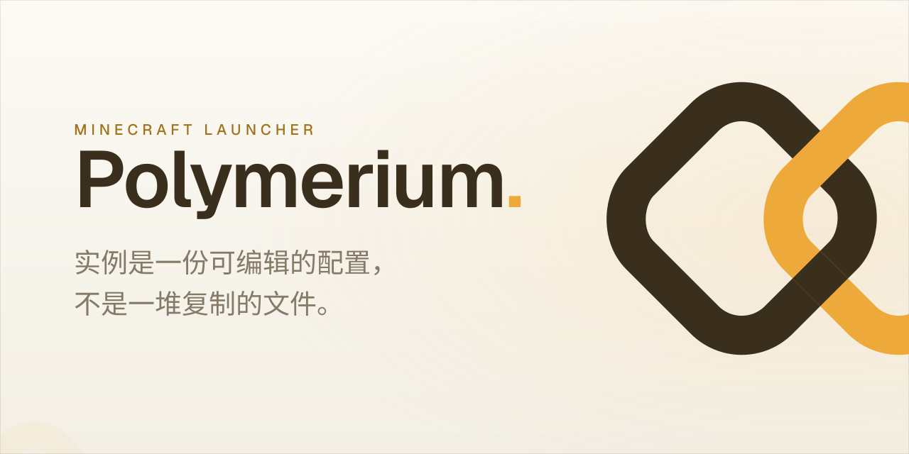

# Polymerium

<a href="https://polymerium.dearain.dev">
  <picture>
    <source media="(prefers-color-scheme: dark)" srcset="assets/brand/banner-dark.zh.svg">
    <source media="(prefers-color-scheme: light)" srcset="assets/brand/banner-light.zh.svg">
    
  </picture>
</a>

<div align="center">

**一个 Minecraft 启动器，源于一个简单的理念。**

[](https://opensource.org/licenses/MIT)
[](https://dotnet.microsoft.com/)
[](https://avaloniaui.net/)
[](https://learn.microsoft.com/en-us/dotnet/csharp/)
[![zread](https://img.shields.io/badge/Ask_Zread-_.svg?style=for-the-badge&color=00b0aa&labelColor=000000&logo=data%3Aimage%2Fsvg%2Bxml%3Bbase64%2CPHN2ZyB3aWR0aD0iMTYiIGhlaWdodD0iMTYiIHZpZXdCb3g9IjAgMCAxNiAxNiIgZmlsbD0ibm9uZSIgeG1sbnM9Imh0dHA6Ly93d3cudzMub3JnLzIwMDAvc3ZnIj4KPHBhdGggZD0iTTQuOTYxNTYgMS42MDAxSDIuMjQxNTZDMS44ODgxIDEuNjAwMSAxLjYwMTU2IDEuODg2NjQgMS42MDE1NiAyLjI0MDFWNC45NjAxQzEuNjAxNTYgNS4zMTM1NiAxLjg4ODEgNS42MDAxIDIuMjQxNTYgNS42MDAxSDQuOTYxNTZDNS4zMTUwMiA1LjYwMDEgNS42MDE1NiA1LjMxMzU2IDUuNjAxNTYgNC45NjAxVjIuMjQwMUM1LjYwMTU2IDEuODg2NjQgNS4zMTUwMiAxLjYwMDEgNC45NjE1NiAxLjYwMDFaIiBmaWxsPSIjZmZmIi8%2BCjxwYXRoIGQ9Ik00Ljk2MTU2IDEwLjM5OTlIMi4yNDE1NkMxLjg4ODEgMTAuMzk5OSAxLjYwMTU2IDEwLjY4NjQgMS42MDE1NiAxMS4wMzk5VjEzLjc1OTlDMS42MDE1NiAxNC4xMTM0IDEuODg4MSAxNC4zOTk5IDIuMjQxNTYgMTQuMzk5OUg0Ljk2MTU2QzUuMzE1MDIgMTQuMzk5OSA1LjYwMTU2IDE0LjExMzQgNS42MDE1NiAxMy43NTk5VjExLjAzOTlDNS42MDE1NiAxMC42ODY0IDUuMzE1MDIgMTAuMzk5OSA0Ljk2MTU2IDEwLjM5OTlaIiBmaWxsPSIjZmZmIi8%2BCjxwYXRoIGQ9Ik0xMy43NTg0IDEuNjAwMUgxMS4wMzg0QzEwLjY4NSAxLjYwMDEgMTAuMzk4NCAxLjg4NjY0IDEwLjM5ODQgMi4yNDAxVjQuOTYwMUMxMC4zOTg0IDUuMzEzNTYgMTAuNjg1IDUuNjAwMSAxMS4wMzg0IDUuNjAwMUgxMy43NTg0QzE0LjExMTkgNS42MDAxIDE0LjM5ODQgNS4zMTM1NiAxNC4zOTg0IDQuOTYwMVYyLjI0MDFDMTQuMzk4NCAxLjg4NjY0IDE0LjExMTkgMS42MDAxIDEzLjc1ODQgMS42MDAxWiIgZmlsbD0iI2ZmZiIvPgo8cGF0aCBkPSJNNCAxMkwxMiA0TDQgMTJaIiBmaWxsPSIjZmZmIi8%2BCjxwYXRoIGQ9Ik00IDEyTDEyIDQiIHN0cm9rZT0iI2ZmZiIgc3Ryb2tlLXdpZHRoPSIxLjUiIHN0cm9rZS1saW5lY2FwPSJyb3VuZCIvPgo8L3N2Zz4K&logoColor=ffffff)](https://zread.ai/d3ara1n/Polymerium)

[](https://app.codacy.com/gh/d3ara1n/Polymerium/dashboard?utm_source=gh&utm_medium=referral&utm_content=&utm_campaign=Badge_grade)
[](https://www.codefactor.io/repository/github/d3ara1n/polymerium)

[📥 下载](https://github.com/d3ara1n/Polymerium/releases) • [📖 文档](https://polymerium.dearain.dev) • [🐛 报告问题](https://github.com/d3ara1n/Polymerium/issues) • [💡 功能建议](https://github.com/d3ara1n/Polymerium/issues)

</div>

---

## 实际效果

<div align="center">

[](#实际效果)

*从打开应用到启动游戏。*

</div>

---

## 不同之处

> Polymerium 里的实例是一份描述，不是一堆复制的文件。

换加载器、增删模组、更新整个整合包——改的是这份描述，Polymerium 按需重建文件，你的存档和设置原封不动。

- **换加载器不用重来。** Forge 到 NeoForge、Fabric 到 Quilt——改个加载器，重新部署，模组全保留。
- **原地更新整合包。** 导入新版本，你的世界和设置照旧。
- **随时回滚。** 每次改动都能快照。改炸了？一键还原，还能看到具体动了什么。

文件是链接的，不是复制的——十个整合包共用同一批模组，不会占十倍的磁盘。整套配置就一个小文件，可以用 Git 管版本、可以分享、可以搬走。

---

## 功能

<div align="center">
<table>
  <tr>
    <td width="55%" valign="top">
      <b>一目了然</b><br><br>
      你的所有实例、账户、最近玩过的世界都在一处。接着上次的地方继续，或者开个新的。
    </td>
    <td width="45%">
      
    </td>
  </tr>
  <tr>
    <td width="45%">
      
    </td>
    <td width="55%" valign="top">
      <b>部署即启动</b><br><br>
      选个实例，按下启动。Polymerium 一步把配置变成正在运行的游戏——不用手动折腾文件，切换到另一个实例也是瞬间的事。
    </td>
  </tr>
  <tr>
    <td width="55%" valign="top">
      <b>管的是模组，不是文件</b><br><br>
      像浏览列表条目一样浏览、筛选、启用、更新模组——而不是对付一个文件夹里的文件。列表和网格视图随意切，按来源或类型筛选，更新单个模组或整个整合包。
    </td>
    <td width="45%">
      
    </td>
  </tr>
  <tr>
    <td width="45%">
      
    </td>
    <td width="55%" valign="top">
      <b>看懂完整的依赖关系</b><br><br>
      每个模组、每一层依赖，可视化铺开。在按下启动之前就能发现冲突和缺失。
    </td>
  </tr>
  <tr>
    <td width="55%" valign="top">
      <b>从大型市场直接安装</b><br><br>
      CurseForge 和 Modrinth，内置。按游戏版本和加载器搜索筛选，不用离开应用就装进实例。
    </td>
    <td width="45%">
      
    </td>
  </tr>
</table>
</div>

### 还有更多

- **快照** —— 保存和恢复完整的游戏状态，带差异视图。
- **Git 友好的整合包** —— 实例就是个配置文件，可以用 Git 管版本、协作开发。
- **跨平台** —— Windows、Linux、macOS（Apple Silicon）同一套代码。
- **干净卸载** —— 删两个文件夹，Polymerium 彻底消失。

---

## 开始使用

### 安装

> [!NOTE]
> Polymerium 正在积极开发中，功能和界面可能随版本调整。

**Microsoft OAuth · 开源 MIT · 凭据只存本地。**

下载前请先查看对应平台的注意事项：

<details>
<summary>🪟 <strong>Windows</strong> — 启用开发者模式（符号链接所需）</summary>

Polymerium 使用[符号链接](https://www.wikiwand.com/en/Symbolic_link)进行高效的文件管理。启用开发者模式以允许在没有管理员权限的情况下创建符号链接。

**Windows 11**

```sh
设置 → 系统 → 开发者选项 → 开发者模式
```

**Windows 10**

```sh
设置 → 更新和安全 → 开发者选项 → 开发者模式
```

**Windows 7/8**

```sh
请先升级到 Windows 10+ 😉
```

</details>

<details>
<summary>🍎 <strong>macOS</strong> — 「安装包已损坏」处理方法</summary>

由于 PKG 安装包未经 Apple 开发者证书签名，macOS Gatekeeper 可能会阻止安装并提示「安装包已损坏」。

1. 右键点击 `.pkg` 文件，选择 **打开**。
2. 如果仍然无法打开，在终端中移除隔离标记：

   ```bash
   xattr -d com.apple.quarantine Polymerium-osx-arm64-Setup.pkg
   ```

3. 再次打开 `.pkg` 文件，按照安装向导操作即可。

</details>

| 平台                  | 包类型      | 直达下载                                                                                          |
|---------------------|----------|-----------------------------------------------------------------------------------------------|
| Windows x64         | 安装器      | [下载](https://github.com/d3ara1n/Polymerium/releases/latest/download/Polymerium-win-Setup.exe) |
| Linux x64           | AppImage | [下载](https://github.com/d3ara1n/Polymerium/releases/latest/download/Polymerium.AvaloniaImage) |
| macOS Apple Silicon | PKG 安装器  | [下载](https://github.com/d3ara1n/Polymerium/releases/latest/download/Polymerium-osx-Setup.pkg) |

[已有 Mirror酱 CDK？前往 Mirror酱 高速下载](https://mirrorchyan.com/zh/projects?rid=Polymerium&channel=Polymerium_setup&source=github-readme)

1. **下载** 对应平台的安装包
2. **运行** 安装器或可执行文件
3. **按照** 向导完成初始配置

### 快速开始

1. **创建实例** —— 选个 Minecraft 版本和模组加载器
2. **添加内容** —— 从 CurseForge 或 Modrinth 装模组
3. **部署** —— Polymerium 构建游戏文件
4. **游戏** —— 直接启动，或导出成整合包

---

## 架构

| 技术              | 用途             | 集成   |
|-----------------|----------------|------|
| **.NET 10**     | 带 C# 预览功能的运行时  | 核心平台 |
| **Avalonia 12** | 跨平台 XAML UI 框架 | 表示层  |
| **MVVM**        | 关注点分离          | 架构模式 |
| **依赖注入**        | 模块化、可测试的服务     | 服务管理 |
| **响应式扩展**       | 响应式数据流         | 数据流  |

### 项目结构

```sh
Polymerium/
├── website/        # 文档与项目网站
├── src/            # 应用源码
├── submodules/     # 引入的外部项目源码
├── notes/          # 内部笔记
├── changelogs/     # 版本更新日志
├── scripts/        # 构建与发布脚本
├── assets/         # 截图与素材
└── plans/          # 规划文档
```

---

## 平台支持

| 平台                                                                                                         | 状态       |
|------------------------------------------------------------------------------------------------------------|----------|
|  | ✅ **稳定** |
|   | ✅ **稳定** |
|      | ✅ **稳定** |

---

## 隐私与安全

Polymerium 尊重您的隐私：

- **少量遥测**：仅收集最少数据用于调试错误
- **本地存储**：所有数据都保留在您的机器上
- **最小占用**：干净卸载不留痕迹
- **开源**：透明、可审计的代码库

---

## 关于 AI 辅助开发

2026 年之前，Polymerium 的基础库、控件库与桌面应用全部由人工花费数年编写，代码库中不含任何一行 AI 生成的代码。

随着今年几款前沿编码模型问世，AI Agent 开始能够勉强参与项目的构建工作。但实践中发现，当前 LLM 在软件工程素养和领域特定知识（尤其是
Avalonia）上存在致命短板，产出的代码问题较为明显，必须经过人工排查和修复。

尽管有上述局限，Agent 的辅助仍显著加快了开发节奏：原本耗时一个月的任务，现在基本能在一周内交付。工作方式依旧保持不变——AI
负责提出方案并完成劳动密集的初步实现，由人工审阅、修正并完成剩余部分，确保代码方向不偏离预定轨道。

---

## 许可证

本项目采用 MIT 许可证 - 详情请参阅 [LICENSE](LICENSE) 文件。

---

## 项目统计

[](https://www.star-history.com/#d3ara1n/Polymerium&Date)


## 参考资料

### 技术参考

- [Inside a Minecraft Launcher](https://ryanccn.dev/posts/inside-a-minecraft-launcher) - 游戏启动过程和 Fabric/Quilt 部署
- [Tutorial: Writing a Launcher](https://minecraft.fandom.com/zh/wiki/%E6%95%99%E7%A8%8B/%E7%BC%96%E5%86%99%E5%90%AF%E5%8A%A8%E5%99%A8) -
  游戏启动过程指南
- [ForgeWrapper](https://github.com/ZekerZhayard/ForgeWrapper) - Forge 集成参考
- [Microsoft Authentication Scheme](https://wiki.vg/Microsoft_Authentication_Scheme) - 身份验证实现

### 特别感谢

- **Minecraft 社区** - 为了令人难以置信的模组生态系统
- **Avalonia 团队** - 为了出色的跨平台 UI 框架
- **API 提供商** - CurseForge 和 Modrinth 提供的公共 API
- **贡献者** - 每一个帮助 Polymerium 变得更好的人

---

<div align="center">

Polymerium —— 把实例当成一份配置，而不是一堆复制的文件。

</div>
