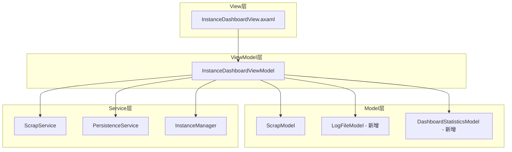
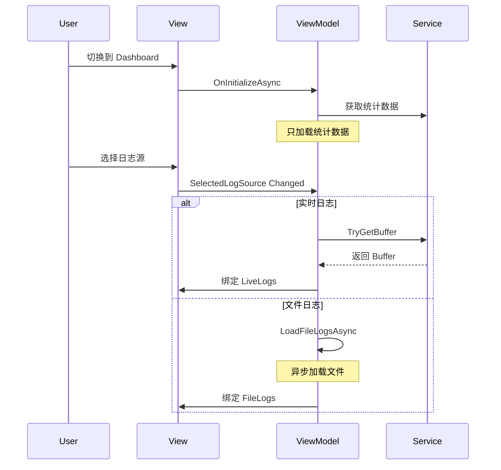

# InstanceDashboardView 仪表盘面板设计文档

## 1. 需求概述

根据需求描述，`InstanceDashboardView` 需要实现以下功能：

### 1.1 顶部统计卡片区域
- **[运行状态]** - 显示当前实例运行状态，运行时背景为主题色
- **[游戏次数]** - 显示游戏启动次数，带按钮打开日志目录
- **[崩溃次数]** - 显示崩溃次数，带按钮打开崩溃报告目录
- **[待添加]** - 预留扩展位置

### 1.2 下半部分日志查看器
- **控制区域（顶部）**
  - 左侧：ComboBox 选择数据源
    - `[实时Live]` - 游戏运行时实时输出日志，否则为空
    - `日志文件` - 静态日志文件列表
  - 右侧：
    - 日志级别过滤（红绿灯：Error/Warning/Information）
    - 保持置底 ToggleButton
- **日志显示区域**
  - 虚拟化列表显示日志
  - 支持按级别着色
- **性能优化**
  - 只有在选中时才加载数据或绑定数据源

---

## 2. 架构设计

### 2.1 整体布局结构

```
┌─────────────────────────────────────────────────────────────┐
│                      顶部卡片区域                             │
│  ┌──────────┐  ┌──────────┐  ┌──────────┐  ┌──────────┐    │
│  │ 运行状态  │  │ 游戏次数  │  │ 崩溃次数  │  │  待添加   │    │
│  │  (动态)   │  │   N次    │  │   N次    │  │          │    │
│  │          │  │ [日志目录]│  │[崩溃报告] │  │          │    │
│  └──────────┘  └──────────┘  └──────────┘  └──────────┘    │
├─────────────────────────────────────────────────────────────┤
│ 控制区域                                                     │
│ ┌───────────────────┐            ┌─┐ ┌─┐ ┌─┐  ┌──────────┐ │
│ │ ComboBox数据源选择 │            │E│ │W│ │I│  │ 置底开关 │ │
│ └───────────────────┘            └─┘ └─┘ └─┘  └──────────┘ │
├─────────────────────────────────────────────────────────────┤
│                                                             │
│                     日志内容区域                              │
│  ┌─────────────────────────────────────────────────────┐   │
│  │ [INFO] [Main] 2024-01-01 12:00:00 Log message...    │   │
│  │ [WARN] [Render] 2024-01-01 12:00:01 Warning msg...  │   │
│  │ [ERROR] [Network] 2024-01-01 12:00:02 Error msg... │   │
│  │ ...                                                  │   │
│  └─────────────────────────────────────────────────────┘   │
│                                                             │
└─────────────────────────────────────────────────────────────┘
```

### 2.2 组件依赖关系



---

## 3. 数据模型设计

### 3.1 LogSourceModel（日志数据源模型）

```csharp
// 文件: src/Polymerium.App/Models/LogSourceModel.cs
public partial class LogSourceModel : ModelBase
{
    public LogSourceKind Kind { get; }
    public string DisplayName { get; }
    public string? FilePath { get; }  // 仅文件类型有值
    public DateTimeOffset? ModifiedAt { get; }  // 仅文件类型有值

    // 用于实时日志
    public static LogSourceModel CreateLive() =>
        new(LogSourceKind.Live, "实时日志", null, null);

    // 用于文件日志
    public static LogSourceModel CreateFile(string path) =>
        new(LogSourceKind.File, Path.GetFileName(path), path, File.GetLastWriteTime(path));
}

public enum LogSourceKind
{
    Live,   // 实时日志
    File    // 日志文件
}
```

### 3.2 LogLevelFilter（日志级别过滤）

```csharp
// 使用现有的 ScrapLevel 枚举
// 文件: Trident.Core/Engines/Launching/ScrapLevel.cs
// - Information
// - Warning
// - Error
```

---

## 4. ViewModel 设计

### 4.1 InstanceDashboardViewModel 扩展

```csharp
// 文件: src/Polymerium.App/ViewModels/InstanceDashboardViewModel.cs
public partial class InstanceDashboardViewModel : InstanceViewModelBase
{
    #region 注入的服务
    private readonly PersistenceService _persistenceService;
    private readonly ScrapService _scrapService;
    #endregion

    #region 统计数据属性
    [ObservableProperty]
    public partial int SessionCount { get; set; }

    [ObservableProperty]
    public partial int CrashCount { get; set; }

    // 运行状态继承自 InstanceViewModelBase.State
    #endregion

    #region 日志数据源
    [ObservableProperty]
    public partial ObservableCollection<LogSourceModel> LogSources { get; set; }

    [ObservableProperty]
    public partial LogSourceModel? SelectedLogSource { get; set; }
    #endregion

    #region 日志过滤
    [ObservableProperty]
    public partial bool ShowInformation { get; set; } = true;

    [ObservableProperty]
    public partial bool ShowWarning { get; set; } = true;

    [ObservableProperty]
    public partial bool ShowError { get; set; } = true;

    [ObservableProperty]
    public partial bool IsAutoScroll { get; set; } = true;
    #endregion

    #region 日志内容
    // 实时日志绑定（来自 ScrapService）
    public NotifyCollectionChangedSynchronizedViewList<ScrapModel>? LiveLogs { get; private set; }

    // 文件日志（懒加载）
    [ObservableProperty]
    public partial ObservableCollection<ScrapModel>? FileLogs { get; set; }

    // 过滤后的视图
    private ISynchronizedView<ScrapModel, ScrapModel>? _filteredView;
    public NotifyCollectionChangedSynchronizedViewList<ScrapModel>? FilteredLogs { get; private set; }
    #endregion

    #region 命令
    [RelayCommand]
    private void OpenLogsFolder();

    [RelayCommand]
    private void OpenCrashReportsFolder();

    [RelayCommand]
    private void RefreshLogSources();
    #endregion

    #region 生命周期
    protected override Task OnInitializeAsync();
    protected override Task OnDeinitializeAsync();
    protected override void OnInstanceLaunching(LaunchTracker tracker);
    protected override void OnInstanceLaunched(LaunchTracker tracker);
    #endregion
}
```

### 4.2 关键方法实现逻辑

```csharp
protected override async Task OnInitializeAsync()
{
    // 1. 加载统计数据
    SessionCount = _persistenceService.GetSessionCount(Basic.Key);
    CrashCount = _persistenceService.GetCrashCount(Basic.Key);

    // 2. 初始化日志源列表
    LogSources = new ObservableCollection<LogSourceModel>();
    RefreshLogSources();

    // 3. 如果当前正在运行，绑定实时日志
    if (State == InstanceState.Running &&
        _scrapService.TryGetBuffer(Basic.Key, out var buffer))
    {
        BindLiveLogs(buffer);
    }

    // 4. 默认选择实时日志源
    SelectedLogSource = LogSources.FirstOrDefault();
}

private void RefreshLogSources()
{
    LogSources.Clear();

    // 添加实时日志源
    LogSources.Add(LogSourceModel.CreateLive());

    // 扫描日志文件
    var logsDir = Path.Combine(PathDef.Default.DirectoryOfBuild(Basic.Key), "logs");
    if (Directory.Exists(logsDir))
    {
        var logFiles = Directory.GetFiles(logsDir, "*.log")
            .OrderByDescending(File.GetLastWriteTime)
            .Take(10);  // 只显示最近10个

        foreach (var file in logFiles)
        {
            LogSources.Add(LogSourceModel.CreateFile(file));
        }
    }
}

partial void OnSelectedLogSourceChanged(LogSourceModel? value)
{
    // 懒加载：只有在选中时才加载
    if (value == null) return;

    if (value.Kind == LogSourceKind.Live)
    {
        // 绑定实时日志
        if (_scrapService.TryGetBuffer(Basic.Key, out var buffer))
        {
            BindLiveLogs(buffer);
        }
        else
        {
            FilteredLogs = null;
        }
    }
    else
    {
        // 加载文件日志
        LoadFileLogsAsync(value.FilePath!);
    }
}

private async Task LoadFileLogsAsync(string filePath)
{
    // 异步加载文件日志，解析为 ScrapModel
    FileLogs = new ObservableCollection<ScrapModel>();
    // ... 解析日志文件
    ApplyFilter();
}

private void ApplyFilter()
{
    // 应用日志级别过滤
    _filteredView?.AttachFilter(scrap =>
        (ShowInformation && scrap.Level == ScrapLevel.Information) ||
        (ShowWarning && scrap.Level == ScrapLevel.Warning) ||
        (ShowError && scrap.Level == ScrapLevel.Error));
}
```

---

## 5. View 设计

### 5.1 InstanceDashboardView.axaml

```xml
<controls:Subpage
    x:Class="Polymerium.App.Views.InstanceDashboardView"
    x:DataType="vm:InstanceDashboardViewModel"
    ScrollViewer.VerticalScrollBarVisibility="Disabled">

    <Grid RowDefinitions="Auto,*" RowSpacing="12">
        <!-- 顶部统计卡片区域 -->
        <UniformGrid Grid.Row="0" Rows="1" Columns="4"
                     HorizontalAlignment="Stretch">

            <!-- 运行状态卡片 -->
            <husk:Card>
                <husk:SwitchPresenter Value="{Binding State}"
                                      TargetType="trident:InstanceState">
                    <!-- Running 状态使用主题色背景 -->
                    <husk:SwitchCase Value="Running">
                        <Border Background="{StaticResource ControlAccentBackgroundBrush}">
                            <!-- 运行中内容 -->
                        </Border>
                    </husk:SwitchCase>
                    <!-- 其他状态 -->
                </husk:SwitchPresenter>
            </husk:Card>

            <!-- 游戏次数卡片 -->
            <husk:Card>
                <Grid RowDefinitions="*,Auto">
                    <StackPanel Grid.Row="0">
                        <TextBlock Text="{Binding SessionCount}"
                                   FontSize="{StaticResource ExtraLargeFontSize}"/>
                        <TextBlock Text="游戏次数"/>
                    </StackPanel>
                    <Button Grid.Row="1"
                            Command="{Binding OpenLogsFolderCommand}"
                            Content="打开日志目录"/>
                </Grid>
            </husk:Card>

            <!-- 崩溃次数卡片 -->
            <husk:Card>
                <Grid RowDefinitions="*,Auto">
                    <StackPanel Grid.Row="0">
                        <TextBlock Text="{Binding CrashCount}"
                                   FontSize="{StaticResource ExtraLargeFontSize}"/>
                        <TextBlock Text="崩溃次数"/>
                    </StackPanel>
                    <Button Grid.Row="1"
                            Command="{Binding OpenCrashReportsFolderCommand}"
                            Content="打开崩溃报告"/>
                </Grid>
            </husk:Card>

            <!-- 待添加卡片 -->
            <husk:Card>
                <TextBlock Text="待添加" Opacity="0.5"/>
            </husk:Card>
        </UniformGrid>

        <!-- 日志查看器区域 -->
        <husk:Card Grid.Row="1" Padding="0">
            <Grid RowDefinitions="Auto,*">
                <!-- 控制区域 -->
                <Grid Grid.Row="0" ColumnDefinitions="Auto,*,Auto"
                      Margin="12">
                    <!-- 数据源选择 -->
                    <ComboBox Grid.Column="0"
                              ItemsSource="{Binding LogSources}"
                              SelectedItem="{Binding SelectedLogSource}">
                        <ComboBox.ItemTemplate>
                            <DataTemplate x:DataType="m:LogSourceModel">
                                <StackPanel Orientation="Horizontal" Spacing="8">
                                    <iconPacks:PackIconLucide
                                        Kind="{Binding Kind, Converter=...}"/>
                                    <TextBlock Text="{Binding DisplayName}"/>
                                </StackPanel>
                            </DataTemplate>
                        </ComboBox.ItemTemplate>
                    </ComboBox>

                    <!-- 右侧控制 -->
                    <StackPanel Grid.Column="2" Orientation="Horizontal"
                                Spacing="8">
                        <!-- 日志级别过滤按钮 -->
                        <ToggleButton IsChecked="{Binding ShowError}"
                                      Background="{StaticResource ControlDangerBackgroundBrush}">
                            <iconPacks:PackIconLucide Kind="CircleX"/>
                        </ToggleButton>
                        <ToggleButton IsChecked="{Binding ShowWarning}"
                                      Background="{StaticResource ControlWarningBackgroundBrush}">
                            <iconPacks:PackIconLucide Kind="TriangleAlert"/>
                        </ToggleButton>
                        <ToggleButton IsChecked="{Binding ShowInformation}">
                            <iconPacks:PackIconLucide Kind="Info"/>
                        </ToggleButton>

                        <husk:Divider Orientation="Vertical"/>

                        <!-- 保持置底按钮 -->
                        <ToggleButton IsChecked="{Binding IsAutoScroll}">
                            <fi:SymbolIcon Symbol="TextBoxAlignBottom"/>
                        </ToggleButton>
                    </StackPanel>
                </Grid>

                <!-- 日志内容区域 -->
                <ScrollViewer Grid.Row="1" x:Name="LogViewer">
                    <ItemsControl ItemsSource="{Binding FilteredLogs}">
                        <ItemsControl.ItemsPanel>
                            <ItemsPanelTemplate>
                                <VirtualizingStackPanel/>
                            </ItemsPanelTemplate>
                        </ItemsControl.ItemsPanel>
                        <ItemsControl.ItemTemplate>
                            <DataTemplate x:DataType="m:ScrapModel">
                                <!-- 复用 InstanceDashboardToast 的日志条目模板 -->
                            </DataTemplate>
                        </ItemsControl.ItemTemplate>
                    </ItemsControl>
                </ScrollViewer>
            </Grid>
        </husk:Card>
    </Grid>
</controls:Subpage>
```

---

## 6. 性能优化策略

### 6.1 懒加载策略



### 6.2 虚拟化

- 使用 `VirtualizingStackPanel` 作为 ItemsPanel
- 只渲染可见区域的日志条目
- 复用现有的 `ObservableFixedSizeRingBuffer<ScrapModel>`（限制最大9527条）

### 6.3 过滤优化

- 使用 `ISynchronizedView.AttachFilter` 进行过滤
- 过滤在数据源级别进行，避免 UI 层过滤

---

## 7. 可复用组件

| 组件 | 来源 | 用途 |
|------|------|------|
| `ScrapModel` | `Models/ScrapModel.cs` | 日志条目数据模型 |
| `ScrapService` | `Services/ScrapService.cs` | 实时日志缓冲服务 |
| `PersistenceService` | `Services/PersistenceService.cs` | 统计数据服务 |
| `InstanceDashboardToast` | `Toasts/InstanceDashboardToast.axaml` | 日志显示模板参考 |
| `InstanceViewModelBase` | `ViewModels/InstanceViewModelBase.cs` | 基类，提供状态追踪 |
| `PathDef` | `Trident.Abstractions/PathDef.cs` | 路径定义 |

---

## 8. 文件清单

### 8.1 需要创建的文件

| 文件 | 类型 | 说明 |
|------|------|------|
| `Models/LogSourceModel.cs` | Model | 日志数据源模型 |

### 8.2 需要修改的文件

| 文件 | 修改内容 |
|------|----------|
| `ViewModels/InstanceDashboardViewModel.cs` | 添加统计属性、日志源管理、过滤逻辑 |
| `Views/InstanceDashboardView.axaml` | 实现完整的 UI 布局 |
| `Views/InstanceDashboardView.axaml.cs` | 添加自动滚动逻辑 |

### 8.3 可能需要添加的资源

| 资源 | 文件 | 说明 |
|------|------|------|
| 本地化字符串 | `Properties/Resources.resx` | Dashboard 相关的文本 |

---

## 9. 实现顺序建议

1. **阶段一：基础结构**
   - 创建 `LogSourceModel.cs`
   - 扩展 `InstanceDashboardViewModel.cs` 基础属性

2. **阶段二：UI 实现**
   - 实现顶部统计卡片
   - 实现日志控制区域
   - 实现日志显示区域

3. **阶段三：功能完善**
   - 实现日志源切换
   - 实现日志过滤
   - 实现自动滚动

4. **阶段四：优化**
   - 性能测试
   - 添加本地化
   - 样式调整

---

## 10. 风险与注意事项

1. **日志文件解析**：需要处理不同格式的日志文件
2. **内存管理**：大量日志时需要注意内存占用
3. **线程安全**：实时日志更新需要在 UI 线程
4. **状态同步**：需要正确处理实例状态变化


---

## 11. 优化后的日志查看器设计

### 11.1 现有 Toast 组件的问题分析

| 问题 | 描述 | 影响 |
|------|------|------|
| 布局拥挤 | Sender、Thread、Time 标签挤在右上角 | 信息难以阅读 |
| 交互反直觉 | 悬停时隐藏信息面板 | 用户无法复制信息 |
| 缺少级别图标 | 仅靠颜色区分日志级别 | 可访问性差 |
| 空间利用低 | 每条日志占用过多垂直空间 | 可见日志条数少 |
| 过滤功能弱 | 只有内容过滤，无级别过滤 | 无法快速定位问题 |

### 11.2 优化后的日志条目设计

采用**紧凑单行布局**的设计理念，参考现代 IDE 的日志查看器：

```
┌─────────────────────────────────────────────────────────────────────────────┐
│ 🔵 12:00:00 [Main/RENDER] Loading texture atlas: blocks/stone.png          │
├─────────────────────────────────────────────────────────────────────────────┤
│ ⚠️ 12:00:01 [Render/WARN] Texture not found: missing_texture.png           │
├─────────────────────────────────────────────────────────────────────────────┤
│ ❌ 12:00:02 [Network/ERR] Connection timeout after 30s                      │
└─────────────────────────────────────────────────────────────────────────────┘
```

### 11.3 重新设计的日志条目模板

```xml
<!-- 优化后的日志条目模板 - 紧凑单行布局 -->
<DataTemplate x:Key="OptimizedScrapTemplate" x:DataType="m:ScrapModel">
    <Border x:Name="Root"
            Padding="8,4"
            Margin="0,0,0,1"
            BorderThickness="2,0,0,0">
        <Grid ColumnDefinitions="20,56,Auto,*">
            <!-- 级别图标 -->
            <Panel Grid.Column="0" VerticalAlignment="Center">
                <husk:SwitchPresenter Value="{Binding Level}"
                                      TargetType="launching:ScrapLevel">
                    <husk:SwitchCase Value="Information">
                        <Ellipse Width="8" Height="8"
                                 Fill="{StaticResource ControlAccentForegroundBrush}"
                                 HorizontalAlignment="Center"/>
                    </husk:SwitchCase>
                    <husk:SwitchCase Value="Warning">
                        <iconPacks:PackIconLucide Kind="TriangleAlert"
                                                  Width="12" Height="12"
                                                  Foreground="{StaticResource ControlWarningForegroundBrush}"
                                                  HorizontalAlignment="Center"/>
                    </husk:SwitchCase>
                    <husk:SwitchCase Value="Error">
                        <iconPacks:PackIconLucide Kind="CircleX"
                                                  Width="12" Height="12"
                                                  Foreground="{StaticResource ControlDangerForegroundBrush}"
                                                  HorizontalAlignment="Center"/>
                    </husk:SwitchCase>
                </husk:SwitchPresenter>
            </Panel>

            <!-- 时间戳 - 等宽字体 -->
            <TextBlock Grid.Column="1"
                       Text="{Binding Time, StringFormat=HH:mm:ss}"
                       FontFamily="Cascadia Code, Consolas, monospace"
                       FontSize="{StaticResource SmallFontSize}"
                       Foreground="{StaticResource ControlSecondaryForegroundBrush}"
                       VerticalAlignment="Center"/>

            <!-- 来源标签 [Thread/Sender] -->
            <Border Grid.Column="2"
                    Background="{StaticResource ControlTranslucentHalfBackgroundBrush}"
                    CornerRadius="2"
                    Padding="4,1"
                    Margin="4,0,8,0"
                    VerticalAlignment="Center">
                <TextBlock FontFamily="Cascadia Code, Consolas, monospace"
                           FontSize="{StaticResource SmallFontSize}"
                           Foreground="{StaticResource ControlSecondaryForegroundBrush}">
                    <Run Text="["/>
                    <Run Text="{Binding Thread, FallbackValue=Main}"/>
                    <Run Text="/"/>
                    <Run Text="{Binding Sender, FallbackValue=INFO}"/>
                    <Run Text="]"/>
                </TextBlock>
            </Border>

            <!-- 消息内容 -->
            <TextBlock Grid.Column="3"
                       Text="{Binding Message}"
                       TextTrimming="CharacterEllipsis"
                       ToolTip.Tip="{Binding Message}"
                       VerticalAlignment="Center"/>
        </Grid>
    </Border>
</DataTemplate>
```

### 11.4 级别样式定义

```xml
<!-- 根据日志级别动态应用样式 -->
<ItemsControl.ItemContainerTheme>
    <ControlTheme TargetType="ContentPresenter">
        <Setter Property="Template">
            <ControlTemplate>
                <husk:SwitchPresenter Value="{Binding Level}"
                                      TargetType="launching:ScrapLevel">
                    <!-- Information 级别 - 透明背景 -->
                    <husk:SwitchCase Value="Information">
                        <Border BorderBrush="Transparent"
                                BorderThickness="2,0,0,0"
                                Padding="8,4" Margin="0,0,0,1">
                            <ContentPresenter Content="{Binding}"
                                              ContentTemplate="{StaticResource LogEntryContent}"/>
                        </Border>
                    </husk:SwitchCase>

                    <!-- Warning 级别 - 黄色左边框 + 淡黄背景 -->
                    <husk:SwitchCase Value="Warning">
                        <Border BorderBrush="{StaticResource ControlWarningBorderBrush}"
                                BorderThickness="2,0,0,0"
                                Background="{StaticResource ControlWarningTranslucentQuarterBackgroundBrush}"
                                Padding="8,4" Margin="0,0,0,1">
                            <ContentPresenter Content="{Binding}"
                                              ContentTemplate="{StaticResource LogEntryContent}"/>
                        </Border>
                    </husk:SwitchCase>

                    <!-- Error 级别 - 红色左边框 + 淡红背景 -->
                    <husk:SwitchCase Value="Error">
                        <Border BorderBrush="{StaticResource ControlDangerBorderBrush}"
                                BorderThickness="2,0,0,0"
                                Background="{StaticResource ControlDangerTranslucentQuarterBackgroundBrush}"
                                Padding="8,4" Margin="0,0,0,1">
                            <ContentPresenter Content="{Binding}"
                                              ContentTemplate="{StaticResource LogEntryContent}"/>
                        </Border>
                    </husk:SwitchCase>
                </husk:SwitchPresenter>
            </ControlTemplate>
        </Setter>
    </ControlTheme>
</ItemsControl.ItemContainerTheme>
```

### 11.5 优化后的控制区域

```xml
<!-- 控制区域：更清晰的布局 -->
<Border Grid.Row="0"
        Padding="12,8"
        BorderBrush="{StaticResource ControlBorderBrush}"
        BorderThickness="0,0,0,1">
    <Grid ColumnDefinitions="Auto,12,*,12,Auto,12,Auto">
        <!-- 数据源选择 -->
        <ComboBox Grid.Column="0"
                  MinWidth="180"
                  ItemsSource="{Binding LogSources}"
                  SelectedItem="{Binding SelectedLogSource}">
            <ComboBox.ItemTemplate>
                <DataTemplate x:DataType="m:LogSourceModel">
                    <Grid ColumnDefinitions="Auto,8,*,8,Auto">
                        <iconPacks:PackIconLucide Grid.Column="0"
                            Kind="{Binding Kind, Converter={x:Static local:Converters.LogSourceKindToIcon}}"
                            Width="16" Height="16"
                            VerticalAlignment="Center"/>
                        <TextBlock Grid.Column="2"
                                   Text="{Binding DisplayName}"
                                   VerticalAlignment="Center"/>
                        <TextBlock Grid.Column="4"
                                   Text="{Binding ModifiedAt, StringFormat=MM-dd HH:mm}"
                                   FontSize="{StaticResource SmallFontSize}"
                                   Foreground="{StaticResource ControlSecondaryForegroundBrush}"
                                   IsVisible="{Binding ModifiedAt, Converter={x:Static ObjectConverters.IsNotNull}}"
                                   VerticalAlignment="Center"/>
                    </Grid>
                </DataTemplate>
            </ComboBox.ItemTemplate>
        </ComboBox>

        <!-- 搜索框 -->
        <TextBox Grid.Column="2"
                 Watermark="搜索日志内容..."
                 Text="{Binding FilterText, Mode=TwoWay}">
            <TextBox.InnerLeftContent>
                <iconPacks:PackIconLucide Kind="Search"
                                          Margin="8,0"
                                          Foreground="{StaticResource ControlSecondaryForegroundBrush}"
                                          Width="{StaticResource MediumFontSize}"
                                          Height="{StaticResource MediumFontSize}"
                                          VerticalAlignment="Center"/>
            </TextBox.InnerLeftContent>
            <TextBox.InnerRightContent>
                <StackPanel Orientation="Horizontal" Spacing="4" VerticalAlignment="Center">
                    <TextBlock Foreground="{StaticResource ControlSecondaryForegroundBrush}"
                               FontSize="{StaticResource SmallFontSize}">
                        <Run Text="{Binding FilteredCount, FallbackValue=0}"/>
                        <Run Text="/"/>
                        <Run Text="{Binding TotalCount, FallbackValue=0}"/>
                    </TextBlock>
                    <Button IsVisible="{Binding FilterText, Converter={x:Static StringConverters.IsNotNullOrEmpty}}"
                            Command="{Binding ClearFilterCommand}"
                            ToolTip.Tip="清除过滤">
                        <fi:SymbolIcon Symbol="Dismiss" FontSize="{StaticResource SmallFontSize}"/>
                    </Button>
                </StackPanel>
            </TextBox.InnerRightContent>
        </TextBox>

        <!-- 日志级别过滤器（红绿灯） -->
        <StackPanel Grid.Column="4" Orientation="Horizontal" Spacing="4">
            <!-- Error 过滤 -->
            <ToggleButton IsChecked="{Binding ShowError}"
                          ToolTip.Tip="显示错误日志"
                          Classes="Small">
                <ToggleButton.Styles>
                    <Style Selector="ToggleButton:checked">
                        <Setter Property="Background"
                                Value="{StaticResource ControlDangerTranslucentHalfBackgroundBrush}"/>
                        <Setter Property="Foreground"
                                Value="{StaticResource ControlDangerForegroundBrush}"/>
                    </Style>
                </ToggleButton.Styles>
                <StackPanel Orientation="Horizontal" Spacing="4">
                    <iconPacks:PackIconLucide Kind="CircleX" Width="14" Height="14"/>
                    <TextBlock Text="{Binding ErrorCount}"
                               FontSize="{StaticResource SmallFontSize}"/>
                </StackPanel>
            </ToggleButton>

            <!-- Warning 过滤 -->
            <ToggleButton IsChecked="{Binding ShowWarning}"
                          ToolTip.Tip="显示警告日志"
                          Classes="Small">
                <ToggleButton.Styles>
                    <Style Selector="ToggleButton:checked">
                        <Setter Property="Background"
                                Value="{StaticResource ControlWarningTranslucentHalfBackgroundBrush}"/>
                        <Setter Property="Foreground"
                                Value="{StaticResource ControlWarningForegroundBrush}"/>
                    </Style>
                </ToggleButton.Styles>
                <StackPanel Orientation="Horizontal" Spacing="4">
                    <iconPacks:PackIconLucide Kind="TriangleAlert" Width="14" Height="14"/>
                    <TextBlock Text="{Binding WarningCount}"
                               FontSize="{StaticResource SmallFontSize}"/>
                </StackPanel>
            </ToggleButton>

            <!-- Information 过滤 -->
            <ToggleButton IsChecked="{Binding ShowInformation}"
                          ToolTip.Tip="显示信息日志"
                          Classes="Small">
                <ToggleButton.Styles>
                    <Style Selector="ToggleButton:checked">
                        <Setter Property="Background"
                                Value="{StaticResource ControlAccentTranslucentHalfBackgroundBrush}"/>
                        <Setter Property="Foreground"
                                Value="{StaticResource ControlAccentForegroundBrush}"/>
                    </Style>
                </ToggleButton.Styles>
                <StackPanel Orientation="Horizontal" Spacing="4">
                    <iconPacks:PackIconLucide Kind="Info" Width="14" Height="14"/>
                    <TextBlock Text="{Binding InformationCount}"
                               FontSize="{StaticResource SmallFontSize}"/>
                </StackPanel>
            </ToggleButton>
        </StackPanel>

        <!-- 自动滚动开关 -->
        <ToggleButton Grid.Column="6"
                      IsChecked="{Binding IsAutoScroll}"
                      ToolTip.Tip="保持置底"
                      Classes="Small">
            <fi:SymbolIcon Symbol="TextBoxAlignBottom"
                           FontSize="{StaticResource MediumFontSize}"/>
        </ToggleButton>
    </Grid>
</Border>
```

### 11.6 空状态设计

```xml
<!-- 空状态提示 -->
<Panel Grid.Row="1">
    <StackPanel VerticalAlignment="Center"
                HorizontalAlignment="Center"
                Spacing="8"
                IsVisible="{Binding IsEmpty}">
        <iconPacks:PackIconLucide Kind="FileText"
                                  Width="48" Height="48"
                                  Opacity="0.3"
                                  HorizontalAlignment="Center"/>
        <TextBlock Text="暂无日志"
                   FontSize="{StaticResource LargeFontSize}"
                   Foreground="{StaticResource ControlSecondaryForegroundBrush}"
                   HorizontalAlignment="Center"/>
        <TextBlock Text="{Binding EmptyHint}"
                   FontSize="{StaticResource SmallFontSize}"
                   Foreground="{StaticResource ControlSecondaryForegroundBrush}"
                   HorizontalAlignment="Center"/>
    </StackPanel>

    <!-- 日志列表 -->
    <ScrollViewer x:Name="LogViewer"
                  IsVisible="{Binding !IsEmpty}">
        <!-- 日志内容 -->
    </ScrollViewer>
</Panel>
```

### 11.7 需要添加的 ViewModel 属性

```csharp
// 添加到 InstanceDashboardViewModel

#region 搜索和计数
[ObservableProperty]
public partial string FilterText { get; set; } = string.Empty;

// 各级别日志数量
[ObservableProperty]
public partial int ErrorCount { get; set; }

[ObservableProperty]
public partial int WarningCount { get; set; }

[ObservableProperty]
public partial int InformationCount { get; set; }

// 过滤后数量
public int FilteredCount => FilteredLogs?.Count ?? 0;
public int TotalCount => /* 总日志数 */;

// 空状态
public bool IsEmpty => FilteredLogs == null || FilteredLogs.Count == 0;
public string EmptyHint => SelectedLogSource?.Kind == LogSourceKind.Live
    ? "游戏运行时将显示实时日志"
    : "选择日志文件以查看内容";

[RelayCommand]
private void ClearFilter() => FilterText = string.Empty;
#endregion
```

---

## 12. 更新后的文件清单

### 12.1 需要创建的文件

| 文件 | 类型 | 说明 |
|------|------|------|
| `Models/LogSourceModel.cs` | Model | 日志数据源模型 |
| `Converters/LogSourceKindToIconConverter.cs` | Converter | 日志源类型转图标 |

### 12.2 需要修改的文件

| 文件 | 修改内容 |
|------|----------|
| `ViewModels/InstanceDashboardViewModel.cs` | 添加统计、过滤、搜索、计数属性 |
| `Views/InstanceDashboardView.axaml` | 实现完整 UI（优化后的日志查看器） |
| `Views/InstanceDashboardView.axaml.cs` | 自动滚动逻辑 |

---

## 13. 设计对比总结

| 方面 | 原 Toast 设计 | 优化后设计 |
|------|---------------|------------|
| **布局** | 信息堆叠在右上角 | 单行紧凑布局 |
| **交互** | 悬停隐藏信息 | 悬停高亮行 |
| **图标** | 无级别图标 | 有明确级别图标 |
| **字体** | 普通字体 | 等宽字体对齐 |
| **过滤** | 仅内容过滤 | 级别+内容双重过滤 |
| **计数** | 无统计 | 显示各级别数量 |
| **搜索** | 简单搜索框 | 带结果计数的搜索框 |
| **空状态** | 无提示 | 友好空状态提示 |
