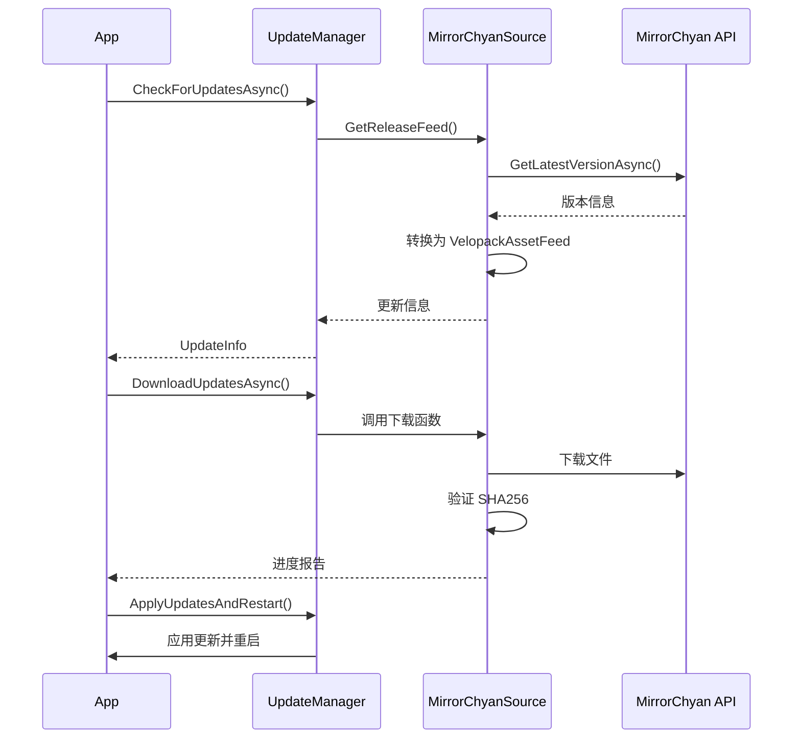

# VelopackExtension.MirrorChyan

MirrorChyan 更新源的 Velopack 集成库，允许你的应用程序通过 MirrorChyan 服务进行自动更新。

## 功能特性

- ✅ 实现 Velopack `IUpdateSource` 接口
- ✅ 自动从 MirrorChyan API 检查更新
- ✅ 支持增量更新和完整更新
- ✅ SHA256 文件完整性验证
- ✅ 下载进度报告
- ✅ 跨平台支持（Windows、Linux、macOS）
- ✅ 多架构支持（x86、x64、ARM64）
- ✅ 依赖注入（DI）集成

## 安装

通过项目引用添加到你的应用程序：

```xml
<ItemGroup>
    <ProjectReference Include="..\VelopackExtension.MirrorChyan\VelopackExtension.MirrorChyan.csproj" />
</ItemGroup>
```

## 使用方法

### 1. 注册服务

在你的应用启动代码中（例如 `Startup.cs` 或 `Program.cs`）：

```csharp
using VelopackExtension.MirrorChyan;

// 在 ConfigureServices 或 DI 容器配置中
services.AddMirrorChyanVelopack(
    productName: "YourProductName",     // MirrorChyan 产品 ID
    currentVersion: "1.0.0",            // 当前应用版本
    cdk: null,                          // 可选：CDK 密钥
    userAgent: "YourApp/1.0.0"          // 可选：自定义 User-Agent
);
```

**注意：** `AddMirrorChyanVelopack` 会自动调用 `AddMirrorChyan` 注册基础服务。

### 2. 检查更新

```csharp
// 从 DI 容器获取 UpdateManager
var updateManager = serviceProvider.GetRequiredService<UpdateManager>();

// 检查更新
var updateInfo = await updateManager.CheckForUpdatesAsync();

if (updateInfo != null)
{
    Console.WriteLine($"发现新版本: {updateInfo.TargetFullRelease.Version}");
    Console.WriteLine($"发布说明: {updateInfo.TargetFullRelease.NotesMarkdown}");
}
```

### 3. 下载并应用更新

```csharp
// 下载更新（带进度报告）
await updateManager.DownloadUpdatesAsync(
    updateInfo,
    progress: percentage =>
    {
        Console.WriteLine($"下载进度: {percentage}%");
    }
);

// 应用更新并重启应用程序
updateManager.ApplyUpdatesAndRestart(updateInfo);
```

## 完整示例

```csharp
using Microsoft.Extensions.DependencyInjection;
using Velopack;
using VelopackExtension.MirrorChyan;

// 配置服务
var services = new ServiceCollection();
services.AddMirrorChyanVelopack(
    productName: "MyApp",
    currentVersion: "1.0.0"
);

var serviceProvider = services.BuildServiceProvider();

// 获取 UpdateManager
var updateManager = serviceProvider.GetRequiredService<UpdateManager>();

// 检查并应用更新
try
{
    var updateInfo = await updateManager.CheckForUpdatesAsync();

    if (updateInfo != null)
    {
        Console.WriteLine($"发现更新: v{updateInfo.TargetFullRelease.Version}");

        // 下载更新
        await updateManager.DownloadUpdatesAsync(
            updateInfo,
            progress: p => Console.WriteLine($"下载中: {p}%")
        );

        Console.WriteLine("下载完成！正在重启应用...");

        // 应用更新并重启
        updateManager.ApplyUpdatesAndRestart(updateInfo);
    }
    else
    {
        Console.WriteLine("已是最新版本");
    }
}
catch (Exception ex)
{
    Console.WriteLine($"更新失败: {ex.Message}");
}
```

## 架构说明

### 核心组件

1. **MirrorChyanSource** - 实现 `IUpdateSource` 接口，负责与 MirrorChyan API 通信
2. **VelopackArchs** - Velopack 架构与 MirrorChyan 架构之间的转换
3. **VelopackOses** - Velopack 操作系统与 MirrorChyan 操作系统之间的转换
4. **ServiceCollectionExtensions** - DI 集成扩展方法

### 工作流程



## 依赖项

- **Velopack** - 应用程序更新框架
- **MirrorChyan.Net** - MirrorChyan API 客户端库

## 许可证

与主项目保持一致。

## 相关链接

- [Velopack 文档](https://github.com/velopack/velopack)
- [MirrorChyan 官网](https://mirrorchyan.com)
